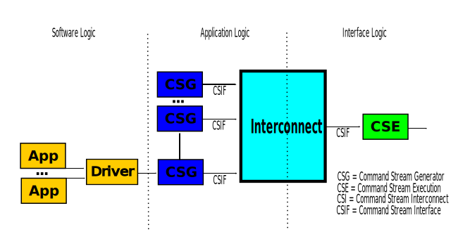
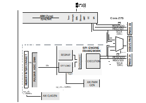

A Precision Converter FPGA Integration Journey
==============================================

This workshop goes through the whole stack for the integration of a precision
converter using an FPGA.

Introduction
------------

**Customer Journey**

.. figure:: intro_customer_journey_1.png
   :align: center

Tools / Platforms are a customer choice, ADI ports to "current" development
environment/kit.

.. figure:: intro_customer_journey_2.png
   :align: center

Maintenance is an ADI burden. Customer don't start their designs at the same
time, and want to use the latest and greatest.

**COS Reference Design "Donut Hole" Strategy**

*Surround others processor, FPGA, micro ADI components*
*Reference design creates stickiness*
*Customer experiences low friction*
*Leverage ecosystems*
*Develop/participate in viable communities / ecosystems:*

- Linux kernel (1.3 Billion users)
- GitHub (40 Million users)
- Python (100 Million users)
- MATLAB (1 Million users)

.. figure:: intro_donut.png
   :width: 500
   :align: center

**COS Full Stack High Level Overview**

.. figure:: intro_full_stack_overview.png
   :align: center

**COS Full Stack HDL Designs**

*Common HDL across all IIO reference designs*

*Full stack reference Designs include JESD204 physical layers (XCVR), link layers, and transport layers.*

- Termination to DMA via an AXI-STREAM or FIFO interface
- Runs across different Intel and Xilinx carriers

*Are designed to be disconnected to "insert custom signal processing"*

- Your modem, your signals intelligence, etc.

*Example designs show how to use MUX in different places in design, to stream debug data (I/Q samples, or payload (data buffers)) as IIO streams.*

*Works with industry standard debug tools:*

- Xilinx Integrated Logic Analyzer
- Intel Signal Tap
- MathWorks HDL Verifier (in SoC Blockset)

.. figure:: ad9081_204b_M4L8.svg
   :align: center

**COS Typical Prototyping System**

.. figure:: intro_typical_system.png
   :align: center

**COS IP Library**

.. figure:: intro_ip_library.png
   :align: center

**COS Frameworks - JESD204 Interface Framework**

*JESD204 Layers:*

- Physical – FPGA specific (GTXE2, GTHE3, GTHE4, GTY4, GTY5, Arria 10, Stratix 10)
- Data Link – GPL 2 and commercial license
- Transport – ADC/DAC/Transceiver specific

*The Framework includes:*

- Evaluation boards
- HDL
- Software

.. figure:: jesd204_chain.svg
   :align: center

**COS Frameworks - SPI Engine Framework**

========================= ===
COS HDL projects          %
========================= ===
JESD PROJECTS             34%
SPI ENGINE PROJECTS       21%
CUSTOM INTERFACE PROJECTS 45%
========================= ===

SPI Engine supports 21.5% of the HLD projects.

.. figure:: intro_spie.svg
   :align: center

SPI Engine Architecture
-----------------------

**Serial Peripheral Interface**

A full-duplex serial communication bus design by Motorola in mid 1980s, used
in short distance chip to chip communication, primarily in embedded systems.
It becomes a 'de facto' standard, with small variations depending on the use
case and application.

.. figure:: spi_master_slave.png
   :align: center

SCLK – Serial Clock from master
MOSI – Master Output Slave Input
MISO – Master Input Slave Output
CSN  – Chip Select N (active low)

======== ==== ====
SPI MODE CPOL CPHA
======== ==== ====
0        0    0
1        0    1
2        1    0
3        1    1
======== ==== ====

.. figure:: spi_modes_2.png
   :align: center

**Why the MCU SPI controller isn't enough?**

*Physical layer challenges:*

- Almost every ADI chip has a 3-wire SPI (but this is not a big issue)
- CS can have other functionalities too (e.g., conversion start)
- Other status or control lines can co-exist (BUSY/CNV)
- Multiple MOSI line can co-exist
- SCLK frequency limited to ~50MHz (higher frequency support is rear)
- Fixed timing relationship of the interface lines
- No possibility to synchronize the interface with other signals
- Limited number of MISO lines
- No DDR support

*All the SPI controllers are fully software driven:*

- Can not support low latency transfers
- Can not support high throughput periodic transfers (capture or send a stream of data)
- Non-deterministic (e.g., time between spi_read function call and the actual SPI transfer is undefined)

**SPI transfers timing diagram – AD4020**

.. figure:: spi_transfer_diagram_ad4020.png
   :align: center

**SPI transfers timing diagram – AD4630**

.. figure:: spi_transfer_diagram_ad4630.png
   :align: center

**SPI Engine Framework – What it is?**

SPI Engine is a highly flexible and powerful SPI controller open-source
framework. It consists out of multiple submodules which communicate over
well-defined interfaces. This allows a high degree of flexibility and
re-usability while at the same time staying highly customizable and easily
extensible.

*Some of the SPI Engine Framework features are:*

- HDL IP supporting the two major FPGA vendors (AMD Xilinx and Intel)
- Software API integrated into the Linux kernel's SPI framework
- Bare-metal software API
- Examples with various devices (device drivers that leverage the framework)

**SPI Engine Framework – HDL Architecture**

*Command Stream Generator (CSG)*

- Software driven (controlled through a register map)
- Hardware driven (MISO or MOSI data offload)
- Generate a predefined command sequence periodically or synchronously

*Command Stream Executor (CSE)*

- Parse an incoming command stream and drive the physical pins on the interface
- Can be a standard parser or a custom parser (e.g. custom SDI latching)

*Command Stream Interconnect (CSI)*

- Arbitrates multiple streams from multiple CSGs to a single CSE

**SPI Engine Framework – AXI SPI Engine IP**

- Memory mapped access to command stream interface
- Fully software controlled CSG

- Memory mapped access to offload control interface
- Allow dynamic reconfiguration of offload block

- SPI clock and AXI clock can be asynchronous

.. figure:: spie_axi_spi_engine_ip.png
   :align: center

**SPI Engine Framework – Data Offload IP**

- Internal RAM/ROM for CMD and SDO stream
- A trigger launches a command stream
- Received data is sent to an AXI4-streaming interface
- It can be connected directly to a DMA

.. figure:: spie_offload_ip.png
   :align: center

**SPI Engine Framework – Interconnect IP**

- Arbitrates multiple command streams into a single CSE
- Arbitration is done at an SPI transaction level (a SYNC instruction must be
  used for end of transaction)
- Lower slave port always take precedence

.. figure:: spie_interconnect_ip.png
   :align: center

**SPI Engine Framework – Execution IP**

- Accepts commands on the control interface
- Generates low-level SPI signals on the SPI interface
- Active signal indicates if the block is busy processing commands

.. figure:: spie_execution_ip.png
   :align: center

**SPI Engine Framework – Command Stream Interfaces**

*4 AXI-Stream interfaces*

- CMD: Instructions
- SDO: SPI write data (MOSI)
- SDI: SPI read data (MISO)
- SYNC: Synchronization events

*Each streams follows standard AXI-Stream handshaking*

- Only the main AXI-stream signals are used (ready, valid, data)

**SPI Engine Framework – Software support**

- Introduces the concept of SPI offload
- Moves certain operations typically performed by the application processor to the SPI controller
- Interrupt offload capability
- Data offload capability
- SPI-Engine is one implementation of SPI offload
- ADI converter drivers can be used with any offload capable SPI controller

**Build prerequisites – HDL repository**

.. figure:: build_prerequisites_hdl.png
   :align: center

**Build prerequisites – Linux repository**

.. figure:: build_prerequisites_linux.png
   :align: center

.. figure:: build_prerequisites_clone.png
   :align: center

Use Case
--------

**What is the use case?**

.. figure:: use_case_examples.png
   :align: center

*Requirements:*

- Highest sampling rate possible with low jitter in sample acquisition
- Maximum SNR
- Minimum THD
- Minimize processor usage for data acquisition and processing

.. figure:: use_case_typical_app.png
   :align: center

.. figure:: use_case_snr.png
   :align: center

.. figure:: use_case_jitter.png
   :align: center

============================ ====================== =====================
Test conditions              Regular SPI controller SPI Engine controller
============================ ====================== =====================
Resolution[bits]             16                     18
Sampling rate[KSPS]          15                     15 and 1330
Input signal frequency[kHz]  1                      1
Input signal amplitude[dBFS] -0.5                   -0.5
Supply voltage [V]           -2.5 and 5             -2.5 and 5
============================ ====================== =====================

**Features of the AD7984 converter**

- High performance
- Throughput: 1.33 MSPS
- True differential analog input range: ±VREF
- 0 V to VREF with VREF between 2.9 V to 5 V
- Zero latency architecture
- 18-bit resolution with no missing codes
- Dynamic range: 99.7 dB, VREF = 5 V
- SNR: 98.5 dB at fIN = 1 kHz, VREF = 5 V
- THD: −110.5 dB at fIN = 1 kHz, VREF = 5 V
- SINAD: 97.5 dB at fIN = 1 kHz, VREF = 5 V

**AD7984 SPI transfer Timing Diagram**

.. figure:: use_case_ad7984_transfer_diagram.png
   :align: center

**Timing parameters needed to configure the framework**

+----------------+--------------+----------------+------------------+----------------+----------------+----------------+
| Device         | Resolution   | Sample rate    | T_SPI_SCLK min   | T_CONV max     | T_CYC min      | T_ACQ min      |
|                | [bits]       | [KSPS]         | [ns]             | [ns]           | [ns]           | [ns]           |
+================+==============+================+==================+================+================+================+
| AD7942         | 14           | 250            | 18               | 2200           | 4000           | 1800           |
+----------------+--------------+----------------+------------------+----------------+----------------+----------------+
| AD7946         | 14           | 500            | 15               | 1600           | 2000           | 400            |
+----------------+--------------+----------------+------------------+----------------+----------------+----------------+
| AD7988-1       | 16           | 100            | 12               | 9500           | 1000           | 500            |
+----------------+--------------+----------------+------------------+----------------+----------------+----------------+
| AD7685         | 16           | 250            | 15               | 2200           | 4000           | 1800           |
+----------------+--------------+----------------+------------------+----------------+----------------+----------------+
| AD7687         | 16           | 250            | 10               | 2200           | 4000           | 1800           |
+----------------+--------------+----------------+------------------+----------------+----------------+----------------+
| AD7691         | 16           | 250            | 15               | 2200           | 4000           | 1800           |
+----------------+--------------+----------------+------------------+----------------+----------------+----------------+
| AD7686         | 16           | 500            | 15               | 1600           | 2000           | 400            |
+----------------+--------------+----------------+------------------+----------------+----------------+----------------+
| AD7693         | 16           | 500            | 15               | 1600           | 2000           | 400            |
+----------------+--------------+----------------+------------------+----------------+----------------+----------------+
| AD7988-5(B)    | 16           | 500            | 12               | 1600           | 2000           | 400            |
+----------------+--------------+----------------+------------------+----------------+----------------+----------------+
| AD7988-5(C)    | 16           | 500            | 12               | 1200           | 2000           | 800            |
+----------------+--------------+----------------+------------------+----------------+----------------+----------------+
| AD7980         | 16           | 1000           | 10               | 710            | 1000           | 290            |
+----------------+--------------+----------------+------------------+----------------+----------------+----------------+
| AD7983         | 16           | 1333           | 12               | 500            | 750            | 250            |
+----------------+--------------+----------------+------------------+----------------+----------------+----------------+
| AD7982         | 18           | 1000           | 12               | 710            | 1000           | 290            |
+----------------+--------------+----------------+------------------+----------------+----------------+----------------+
| AD7982         | 18           | 1000           | 12               | 710            | 1000           | 290            |
+----------------+--------------+----------------+------------------+----------------+----------------+----------------+
| **AD7984**     | **18**       | **1333**       | **12**           | **500**        | **750**        | **250**        |
+----------------+--------------+----------------+------------------+----------------+----------------+----------------+

**HDL design block diagram**

**HDL Framework instantiation**

- TCL Function header:

.. code-block:: tcl

  proc spi_engine_create {{name "spi_engine"} {data_width 32} {async_spi_clk 1} {num_cs 1} {num_sdi 1} {sdi_delay 0} {echo_sclk 0}}

- Instantiation example for PulSAR ADC:

.. code-block:: tcl

  source $ad_hdl_dir/library/spi_engine/scripts/spi_engine.tcl4
  set data_width32
  set async_spi_clk1
  set num_cs1
  set num_sdi1
  set sdi_delay1
  set hier_spi_enginespi_pulsar_adc
  spi_engine_create $hier_spi_engine $data_width $async_spi_clk $num_cs $num_sdi $sdi_delay

#. DATA_WIDTH - will set the width of the data bus / data line used by the SPI
Engine to connect tothe DMA. It will also set the maximum word length for the
SPI transfer. Since the Pulsar_ADC devices are all single SDI/SDO and some of
them require 18bit transfers, this value will be rounded to 32bit.

#. ASYNC_SPI_CLK - will chose the reference clock for the SPI Engine. Setting
this to 0 will configure the hierarchy to use the axi clock (100MHz) as the
reference clock. Setting it to 1 will allow for an external reference clock
(SPI_CLK).

#. NUM_CS - selects the number of CS lines.

#. NUM_SDI - selects the number of SDI lines.

#. SDI_DELAY - the latch of the SDI line can be delayed with 1, 2 or 3 SPI core
clock cycle. Needed for designs with high SCLK rate (>50MHz).

**PulSAR ADC Architecture**

.. figure:: use_case_pulsar_arch.png
   :align: center

*ADI AXI PWM GENERATOR*

- ad_ip_parameter pulsar_adc_trigger_gen CONFIG.PULSE_0_PERIOD 120
- ad_ip_parameter pulsar_adc_trigger_gen CONFIG.PULSE_0_WIDTH 1
- ad_connect spi_clk pulsar_adc_trigger_gen/ext_clk
- ad_connect pulsar_adc_trigger_gen/pwm_0 $hier_spi_engine/offload/trigger

*AXI CLKGEN*

- ad_ip_instance axi_clkgen spi_clkgen
- ad_ip_parameter spi_clkgen CONFIG.CLK0_DIV 5
- ad_ip_parameter spi_clkgen CONFIG.VCO_DIV 1
- ad_ip_parameter spi_clkgen CONFIG.VCO_MUL 8
- ad_connect $hier_spi_engine/m_spi pulsar_adc_spi
- ad_connect spi_clk spi_clkgen/clk_0
- ad_connect spi_clk spi_pulsar_adc/spi_clk

*ADI AXI DMA CONTROLLER*

- ad_ip_parameter axi_pulsar_adc_dma CONFIG.DMA_TYPE_SRC 1
- ad_ip_parameter axi_pulsar_adc_dma CONFIG.DMA_TYPE_DEST 0
- ad_ip_parameter axi_pulsar_adc_dma CONFIG.CYCLIC 0
- ad_ip_parameter axi_pulsar_adc_dma CONFIG.SYNC_TRANSFER_START 0
- ad_ip_parameter axi_pulsar_adc_dma CONFIG.AXI_SLICE_SRC 0
- ad_ip_parameter axi_pulsar_adc_dma CONFIG.AXI_SLICE_DEST 1
- ad_ip_parameter axi_pulsar_adc_dma CONFIG.DMA_2D_TRANSFER 0
- ad_ip_parameter axi_pulsar_adc_dma CONFIG.DMA_DATA_WIDTH_SRC 32
- ad_ip_parameter axi_pulsar_adc_dma CONFIG.DMA_DATA_WIDTH _DEST 64
- ad_connect spi_clk axi_pulsar_adc_dma/s_axis_aclk

**Debug options – ILA**

.. figure:: use_case_debug_options_ila.png
   :align: center

**Debug options – regular SPI controller transfer capture**

.. figure:: use_case_debug_options_spi.png
   :align: center

**Debug options –SPI Engine controller transfer capture**

.. figure:: use_case_debug_options_spie.png
   :align: center

Build System
------------

.. figure:: system_build_bd.png
   :align: center

**System Build - ADALM2000**

.. figure:: system_build_m2k.png
   :align: center

- Two programmable power supplies
- Two-channel USB digital oscilloscope
- Two-channel arbitrary function generator
- 16-channel digital logic analyzer (3.3V CMOS and 1.8V or 5V tolerant, 100MS/s)

**System Build - Scopy**

.. figure:: system_build_scopy.png
   :align: center

Uses the ADALM2000 to implement virtual instruments:

- Oscilloscope (with Mixed Signal Capability)
- Signal Generator (Functions and Arbitrary)
- Spectrum Analyzer
- Network Analyzer
- Voltmeter
- Power Supply
- Logic Analyzer (with Stack Decoder support)
- Digital Pattern Generator
- GPIO

**System Build - Schematic**

.. figure:: system_build_schematic.png
   :align: center

**System Build - Cora Z7S Configuration**

.. figure:: system_build_cora.png
   :align: center

**System Build - Power Supply**

.. figure:: system_build_power_supply.png
   :align: center

**System Build - Input Signal**

.. figure:: system_build_input_signal.png
   :align: center

**System Build - UART Configuration**

.. figure:: system_build_uart.png
   :align: center

**System Build – change host IP**

.. figure:: system_build_ip.png
   :align: center

**System Build - UART and Ethernet Testing**

Step 1 - using Putty

.. shell::
   :caption: ifconfig
   :user: root

   $ifconfig
    eth0: flags=4163<UP,BROADCAST,RUNNING,MULTICAST>  mtu 1500
        inet 169.254.92.202  netmask 255.255.255.0  broadcast 10.48.65.255
        inet6 fe80::241:8f:d3d0:e43b  prefixlen 64  scopeid 0x20<link>
        ether 0e:23:90:e3:61:01  txqueuelen 1000  (Ethernet)
        RX packets 483757  bytes 81480222 (77.7 MiB)
        RX errors 0  dropped 0  overruns 0  frame 0
        TX packets 5562  bytes 775511 (757.3 KiB)
        TX errors 0  dropped 0 overruns 0  carrier 0  collisions 0
        device interrupt 38

    lo: flags=73<UP,LOOPBACK,RUNNING>  mtu 65536
        inet 127.0.0.1  netmask 255.0.0.0
        inet6 ::1  prefixlen 128  scopeid 0x10<host>
        loop  txqueuelen 1000  (Local Loopback)
        RX packets 83  bytes 10176 (9.9 KiB)
        RX errors 0  dropped 0  overruns 0  frame 0
        TX packets 83  bytes 10176 (9.9 KiB)
        TX errors 0  dropped 0 overruns 0  carrier 0  collisions 0

Step 2 - using Cygwin

.. shell::
   :caption: ping 169.254.92.202

   $ping 169.254.92.202

    Pinging 169.254.92.202 with 32 bytes of data:
    Reply from 169.254.92.202: bytes=32 time=2ms TTL=64
    Reply from 169.254.92.202: bytes=32 time=1ms TTL=64
    Reply from 169.254.92.202: bytes=32 time=1ms TTL=64
    Reply from 169.254.92.202: bytes=32 time=1ms TTL=64

    Ping statistics for 169.254.92.202:
      Packets: Sent = 4, Received = 4, Lost = 0 (0% loss),
    Approximate round trip times in milli-seconds:
      Minimum = 1ms, Maximum = 2ms, Average = 1ms

Evaluate System
---------------

**System Evaluation – regular SPI trigger configuration**

.. figure:: system_evaluation_spi_trigger_1.png
   :align: center

.. figure:: system_evaluation_spi_trigger_2.png
   :align: center

**System Evaluation**

=========================================================== ====================== =====================
Steps                                                       Regular SPI controller SPI Engine controller
=========================================================== ====================== =====================
Connect IIO Oscilloscope and visualize the captured signals
Run the Python script on `Cora Z7S`_ / Cygwin
Analyze results in VisualAnalog
Compare the results
=========================================================== ====================== =====================

**System Evaluation - IIO Oscilloscope**

.. figure:: system_evaluation_iio_osc_1.png
   :align: center

.. figure:: system_evaluation_iio_osc_2.png
   :align: center

**System Evaluation - Logic Analyzer**

.. figure:: system_evaluation_m2k_1.png
   :align: center

.. figure:: system_evaluation_m2k_2.png
   :align: center

**System Evaluation**

=========================================================== ====================== =====================
Steps                                                       Regular SPI controller SPI Engine controller
=========================================================== ====================== =====================
Connect IIO Oscilloscope and visualize the captured signals           X
Run the Python script on `Cora Z7S`_ / Cygwin
Analyze results in VisualAnalog
Compare the results
=========================================================== ====================== =====================

**System Evaluation - Python script**

.. figure:: system_evaluation_spi_python_script.png
   :align: center

**System Evaluation – Python from the FPGA board**

.. figure:: system_evaluation_spi_python_from_fpga_1.png
   :align: center

.. figure:: system_evaluation_spi_python_from_fpga_2.png
   :align: center

**System Evaluation – Python from a remote machine - optional**

.. figure:: system_evaluation_spi_python_from_remote_1.png
   :align: center

.. figure:: system_evaluation_spi_python_from_remote_2.png
   :align: center

.. figure:: system_evaluation_spi_python_from_remote_3.png
   :align: center

**System Evaluation**

=========================================================== ====================== =====================
Steps                                                       Regular SPI controller SPI Engine controller
=========================================================== ====================== =====================
Connect IIO Oscilloscope and visualize the captured signals           X
Run the Python script on `Cora Z7S`_ / Cygwin                         X
Analyze results in VisualAnalog
Compare the results
=========================================================== ====================== =====================

**System Evaluation - IIO Oscilloscope**

.. figure:: system_evaluation_cora_and_iio_osc.png
   :align: center

**System Evaluation**

=========================================================== ====================== =====================
Steps                                                       Regular SPI controller SPI Engine controller
=========================================================== ====================== =====================
Connect IIO Oscilloscope and visualize the captured signals           X                     X
Run the Python script on `Cora Z7S`_ / Cygwin                         X
Analyze results in VisualAnalog
Compare the results
=========================================================== ====================== =====================

**System Evaluation – Python from the FPGA board**

.. shell::
   :caption: cd /boot/

    $cd /cygdrive/c/work/fae_workshop_workspace

.. figure:: system_evaluation_spie_python_from_fpga_1.png
   :align: center

.. figure:: system_evaluation_spie_python_from_fpga_2.png
   :align: center

**System Evaluation – Python from a remote machine - optional**

.. figure:: system_evaluation_spie_python_from_remote_1.png
   :align: center

.. figure:: system_evaluation_spie_python_from_remote_2.png
   :align: center

.. figure:: system_evaluation_spie_python_from_remote_3.png
   :align: center

**System Evaluation**

=========================================================== ====================== =====================
Steps                                                       Regular SPI controller SPI Engine controller
=========================================================== ====================== =====================
Connect IIO Oscilloscope and visualize the captured signals           X                     X
Run the Python script on `Cora Z7S`_ / Cygwin                         X                     X
Analyze results in VisualAnalog
Compare the results
=========================================================== ====================== =====================

.. shell::
   :caption: cd /cygdrive/c/work/fae_workshop_workspace

   $cd /cygdrive/c/work/fae_workshop_workspace

.. shell::
   :caption: scp root@169.254.92.202L/boot/workshop/fae_workshop_visual.vac .

   $scp root@169.254.92.202L/boot/workshop/fae_workshop_visual.vac .
    root@169.254.92.202's password:analog
    fae_worksop_visual.vac                        100% 17KB     1.7MB/s   00:00

.. figure:: system_evaluation_analyse_results.png
   :align: center

**System Evaluation–Analyze results (SPI Engine-1.3MSPS)**

.. figure:: system_evaluation_analyse_results_spie_1m3.png
   :align: center

**System Evaluation–Analyze results (Regular SPI -15KSPS)**

.. figure:: system_evaluation_analyse_results_spi_1k5.png
   :align: center

**System Evaluation–Analyze results (SPI Engine-15KSPS)**

.. figure:: system_evaluation_analyse_results_spie_1k5.png
   :align: center

**System Evaluation**

=========================================================== ====================== =====================
Steps                                                       Regular SPI controller SPI Engine controller
=========================================================== ====================== =====================
Connect IIO Oscilloscope and visualize the captured signals           X                     X
Run the Python script on `Cora Z7S`_ / Cygwin                         X                     X
Analyze results in VisualAnalog                                       X                     X
Compare the results
=========================================================== ====================== =====================

**System Evaluation – Results comparison**

=========================================== ========= ================================== ================================== ====================================
Parameter                                   Datasheet Regular SPI controller             SPI Engine controller              SPI Engine controller
                                                      (Fin=1kHz, SR=15KHz, Ain=-0.5dBFS) (Fin=1kHz, SR=15KHz, Ain=-0.5dBFS) (Fin=1kHz, SR=1.33MHz, Ain=-0.5dBFS)
=========================================== ========= ================================== ================================== ====================================
Signal-to-Noise SNR [dBFS]                     98.5                 14.81                               78.60                               77.70
Spurious-Free Dynamic Range SFDR [dBFS]       112.5                 21.13                               92.97                               99.15
Total Harmonic Distortion THD [dBFS]         -110.5                -45.65                              -99.20                                -110
Signal-to-(Noise + Distortion) SINAD [dBFS]      98                 14.30                                  78                               77.20
=========================================== ========= ================================== ================================== ====================================

**System Evaluation**

=========================================================== ====================== =====================
Steps                                                       Regular SPI controller SPI Engine controller
=========================================================== ====================== =====================
Connect IIO Oscilloscope and visualize the captured signals           X                     X
Run the Python script on `Cora Z7S`_ / Cygwin                         X                     X
Analyze results in VisualAnalog                                       X                     X
Compare the results                                                   X                     X
=========================================================== ====================== =====================

Conclusions
-----------

#. A classic MCU can be used for converters that have the sampling rate up to
   100kSPS.
#. Maximum performance, in terms of sampling rate, SNR, THD can be only
   achieved with an FPGA.
#. SPI Engine is a highly flexible and powerful open-source SPI controller
   framework which can interface a wide range of precision converters.
#. We are now familiar with the COS group open-source solution stack.

**Thank You!**

**Related Presentations**

- My customer uses an FPGA in his product. Now what?
- ADALM2000 in real life applications
- Just enough Software and HDL for High-Speed designs
- Hardware and Software Tools for Precision Wideband Instrumentation

**Questions?**
:ez:`community/university-program`

.. _Cora Z7S: https://digilent.com/shop/cora-z7-zynq-7000-single-core-for-arm-fpga-soc-development
