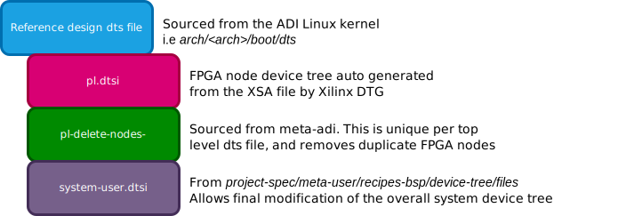

.. _petalinux petalinux-dts:

Petalinux Device Trees
======================

Petalinux is Xilinx's flavor of Linux based on the Yocto project.  One of the
unique pieces of Petalinux is how the device tree is automatically generated
based on the imported XSA/HDF file, using Xilinx's Device Tree Generator (DTG).
The generated device tree includes nodes for the PS as well as nodes for the
Xilinx blocks located in the PL.  The DTG regenerates the device tree on each
build, which makes it difficult to edit the .dts files directly for modification.
Further, the PL nodes may conflict with Linux device drivers which may access
the FPGA blocks.  This is especially a problem for ADI's provided reference
designs which use IIO based drivers for accessing FPGA IP.

For *meta-adi*, the work around for device trees is to effectively be a
man-in-the-middle during the build process, overwriting the auto-generated
device tree.  During the ``do_configure()`` stage, the device tree recipe of the
*meta-adi* layer will perform the following actions:

#. Replace the DTG generated system-top.dts with the specified device tree from
   the ADI Kernel source tree.
#. The DTG generated pl.dtsi file will then be included to capture the FPGA
   block device nodes.
#. The ADI specific pl-delete-nodes file, which removes any duplicates between
   the DTG generated PL nodes and the ones specified by the selected device tree,
   is added.
#. Finally, the *meta-user* system-user.dtsi is included to allow modification of
   the tree by the user.

A high-level view of the final *meta-adi* device tree looks like the following:

Device Tree Modifications
-------------------------
With Petalinux and *meta-adi*, there are several methods of modifying the device
tree contents for your application. The following breaks down a few approaches
as well as recommended use cases:

.. list-table::
   :header-rows: 1

   * - Method
     - Description
     - Use Case
   * - :doc:`system-user.dtsi <petalinux-system-user>`
     - Add and modify nodes of a ADI provided device tree through the system-user.dtsi
       file
     - Working with a standard evaluation kit and baseline reference design, with
       minimal device tree adjustments.
   * - :doc:`meta-adi and custom dts file <petalinux-custom-dts>`
     - Use a custom .dts file as the top of the device tree hierarchy, but still
       have access to the dtsi files available in the ADI Kernel source tree
     - Working with a standard evaluation kit and baseline reference design, with
       significant additional device nodes, or the breadth of changes are too
       great to be done in system-user.dtsi to maintain an easy to follow update.
       *This can also be used with custom hardware*
   * - :doc:`Bypass meta-adi, Petalinux DTG <petalinux-meta-adi-bypass>`
     - Start with a trimmed down device tree generated by the DTG, with custom
       capabilities added.  The *meta-adi* device tree recipe is bypassed,
       leveraging the DTG output as-is.
     - This may be ideal when working with custom hardware without an existing
       device tree in kernel source.

.. toctree::
   :hidden:
   :glob:

   *
