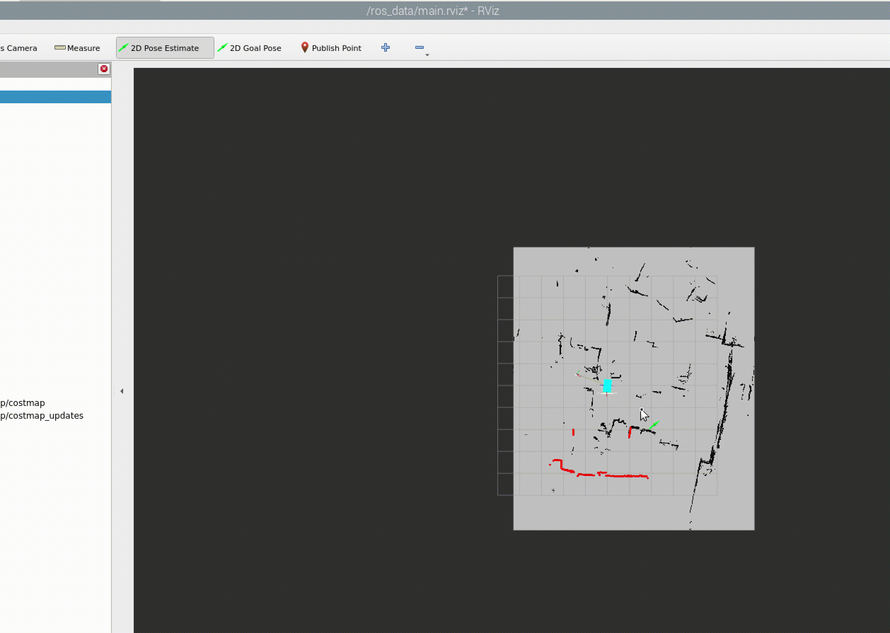

AD-R1M Milano Robot Quickstart
==============================

This guide helps you bring up the AD-R1M robot quickly using VNC and SSH to access the onboard computers.

Power Up
--------
Use the side-panel buttons to power and initialize the robot electronics.

.. figure:: ../figures/robot-buttons.png
   :alt: Robot side buttons: 1 (silver, power), 2 (red, joystick receiver reset), 3 (green, not used)
   :align: center
   :width: 500px

- **Button 1 (silver)**: Press to **power up** the robot. It will latch/stay pressed.
- **Button 2 (red)**: Press to reset the RC transceiver. You should hear an audio output indicating the tele‑joystick connected to the robot.
- Button 3 (green): Not used in this configuration.

After power‑up, an onboard bring‑up script runs on the Portenta microcontroller so you can control the platform.

Remote Control
--------------

.. figure:: ../figures/remote-control.png
   :alt: Remote control layout with KILLSWITCH (SB), lift (SC), power, and TELE buttons
   :align: center
   :width: 500px

- **Power on the RC**: press the On/Off button. The screen will show the model configuration and the RC battery state.
- **View robot battery**: press the ``TELE`` button (bottom-left). The display shows ``RxBt`` indicating the robot battery level.

.. admonition:: Important
   :class: note

   Ensure the robot battery (``RxBt``) does not drop below **9 V**.

- **Enable motion**: move the KILLSWITCH (``SB``) to the OFF position (as shown in the figure). The robot will slightly shake to indicate it is enabled.
- **Drive**: use the indicated CONTROL GIMBAL to command the robot (forward/back/turn ~ up/down/left-right).
- **Lift**: use switch ``SC`` to raise/hold/lower the lift as labeled in the figure.

Network Setup
-------------
Connect your workstation to the robot’s Wi‑Fi network before starting.

.. figure:: ../figures/wifi.png
   :alt: Connect to ADIADV_LIFT Wi‑Fi network
   :align: center
   :width: 400px

- SSID: ``ADIADV_LIFT``
- Password: ``Sq7e4T9W``

Device Access
-------------
After connecting to the Wi‑Fi, you can access onboard computers as follows.

Portenta (MCU controller)
~~~~~~~~~~~~~~~~~~~~~~~~~
- SSH:

  .. code-block:: bash

      ssh analog@ad-r1m-portenta-milano.local

- Credentials: user ``analog`` / password ``analog``

.. figure:: ../figures/ssh.png
   :alt: SSH to Portenta board
   :align: center
   :width: 400px

Raspberry Pi (edge computer)
~~~~~~~~~~~~~~~~~~~~~~~~~~~~
- SSH:

  .. code-block:: bash

      ssh analog@ad-r1m-pi-milano.local

- Credentials: user ``analog`` / password ``analog``

.. figure:: ../figures/ssh_rpi.png
   :alt: SSH to Raspberry Pi
   :align: center
   :width: 400px

- VNC:
   - Install `VNC Viewer <https://www.realvnc.com/en/connect/download/viewer/>`_
   - Open Viewer → File → New Connection
   - VNC Server: ``ad-r1m-pi-milano.local``
   - Credentials: user ``analog`` / password ``analog``

.. figure:: ../figures/vnc_connect.png
   :alt: VNC connection to Raspberry Pi
   :align: center
   :width: 400px

Raspberry Pi Runtime
---------------------

Start docker container and RViz visualization
~~~~~~~~~~~~~~~~~~~~~~~~~~~~~~~~~~~~~~~~~~~~~
After connecting via VNC, run the start_rviz script to start the ROS 2 Docker container and visualize the robot.

.. code-block:: bash

    # In the VNC session on Raspberry Pi
    ~/start_rviz

This launches RViz with the robot model, odometry, and camera laser scan visualization.

.. figure:: ../figures/start_rviz.png
   :alt: RViz startup showing robot model and laser scan with odom fixed frame
   :align: center
   :width: 900px

The RViz window starts with ``odom`` as the fixed frame, displaying the robot model and sensor data.

Mapping
~~~~~~~
To map the environment, run the mapping script and change the fixed frame to visualize the mapping process:

.. code-block:: bash

    # In the VNC session on Raspberry Pi
    ~/do_mapping.sh

Change the fixed frame from ``odom`` to ``map`` in RViz to visualize the mapping process as shown in the figure.

.. figure:: ../figures/do_mapping.png
   :alt: RViz mapping view showing how to change fixed frame to map and mapping process
   :align: center
   :width: 900px

The figure shows how to change the fixed frame in RViz and observe the real-time mapping process.

Move the robot around the environment using the remote control to build the map, as shown in the animated demonstration below.

.. figure:: ../figures/do_mapping.gif
   :align: center
   :width: 1000px
   
   Robot mapping demonstration using remote control

The video shows the complete mapping process where the robot navigates the environment while building a real-time map using SLAM (Simultaneous Localization and Mapping).

Save the map
~~~~~~~~~~~~~~~~
After completing the mapping, open a new terminal and save the map to a file:

.. code-block:: bash

    # In the VNC session on Raspberry Pi
    ~/save_map.sh

This saves the map as ``office-map.pgm`` and ``office-map.yaml`` files in the ``~/ros_data/maps`` directory on the Raspberry Pi.

Localization
~~~~~~~~~~~~

To localize the robot on a previously saved map, run the localization script (make sure you stopped the ``do_mapping.sh`` script first):

.. code-block:: bash

   # In the VNC session on Raspberry Pi
   ~/locate.sh

This starts the AMCL (Adaptive Monte Carlo Localization) node to localize the robot on the saved map (``~/ros_data/maps/office-map.yaml``).

.. note::
   After running the localization script, press the ``2D Pose Estimate`` button in RViz and click on the map to set the initial pose of the robot for better localization, as shown in the video below.

   
   Robot localization demonstration

Navigation
~~~~~~~~~~~~~

Keep the localization script running and open a new terminal to start the navigation stack:

.. code-block:: bash

   # In the VNC session on Raspberry Pi
   ~/navigate.sh

After running the navigation script, you will see the navigation nodes starting in the terminal, as shown in the figure below.

.. figure:: ../figures/navigate-sh.png
   :alt: Navigation terminal showing nodes starting
   :align: center
   :width: 600px

In RViz, you will see the global and local costmaps in light blue and purple.

.. figure:: ../figures/nav_view.png
   :alt: RViz navigation view showing global and local costmaps
   :align: center
   :width: 900px

**Sending a Navigation Goal**

To send a navigation goal, press the ``2D Nav Goal`` button in RViz and click on the map to set the desired destination for the robot, as shown in the video below.
You will see a blue arrow indicating the goal and the robot will start moving towards it.

.. figure:: ../figures/navigate.gif
   :align: center
   :width: 1000px
   
   Robot navigation demonstration using RViz
   
The video shows the robot navigating to the set goal using the navigation stack.

Portenta Runtime
----------------
On the Portenta board, a Docker container runs the core ROS 2 nodes:

- `diff_drive_controller` (ros2_control)
- Remote Control (CRSF) node
- ADI ToF camera node
- ADI IMU node
- Lift controller node

These are started by the bring-up script at ``~/bringup.sh`` on the Portenta after power-up.

To re-run the container and nodes manually:

.. code-block:: bash

    # SSH into Portenta first (user: analog / password: analog)
    ssh analog@ad-r1m-portenta-milano.local

    # Make sure the script is executable
    chmod +x ~/bringup.sh

    # Launch the full stack inside Docker
    ~/bringup.sh

You will see the ROS 2 nodes starting in the terminal, as shown in the figure below.

.. figure:: ../figures/portenta_bringup.png
   :align: center
   :width: 600px

Working with Docker Containers
-------------------------------

**Start Docker container:**

.. code-block:: bash

   docker start ros_app

**Open Docker container:**

.. code-block:: bash

   docker exec -it ros_app bash

The localization and navigation scripts run inside the ``ros_app`` Docker container and use configs and maps stored in the ``~/ros_data`` directory on the Raspberry Pi host.
You can copy configuration and map files from the Docker containers on the Raspberry Pi host system using the following commands:

**Copy map files:**

.. code-block:: bash

   docker cp ros_app:/ros2_ws/src/adrd_demo_ros2/maps/map.yaml ~/ros_data/maps/
   docker cp ros_app:/ros2_ws/src/adrd_demo_ros2/maps/map.pgm ~/ros_data/maps/

**Copy navigation parameters:**

.. code-block:: bash

   docker cp ros_app:/ros2_ws/src/adrd_demo_ros2/config/nav2_params_minimal.yaml ~/ros_data/

**Copy mapper parameters:**

.. code-block:: bash

   docker cp ros_app:/ros2_ws/src/adrd_demo_ros2/config/mapper_params_online_async.yaml ~/ros_data/
